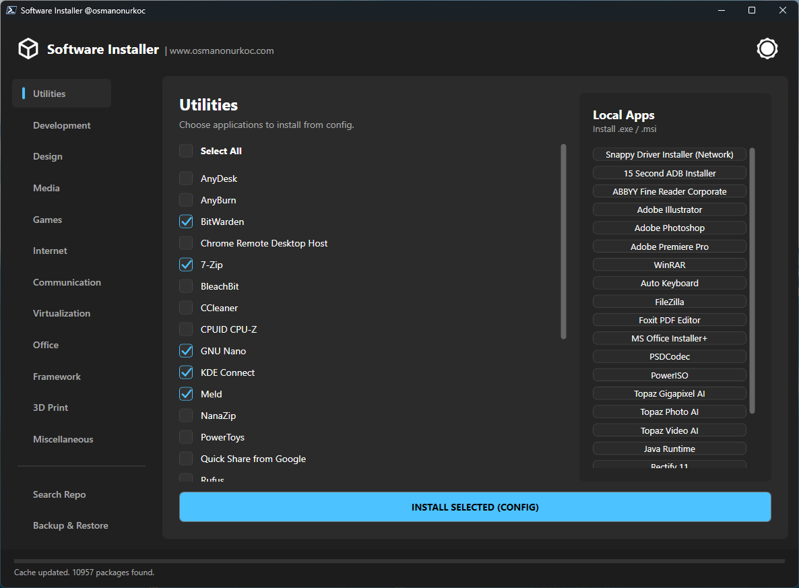

# Software Installer via WinGet and Local


A modern, dark-mode compatible GUI wrapper for the Windows Package Manager (Winget). This tool allows you to bulk install applications defined in a simple XML configuration file, acting as a post-installation setup utility for Windows.

---
### 📥 Download Latest

[](https://github.com/osmanonurkoc/WinGet_Installer/releases/latest)

## 📸 Screenshots

<p align="center">
  
</p>

---

## 🔥 Features

* **Bulk Installation:** Install dozens of apps with a single click.
* **Smart Source Repair:** Automatically detects and fixes Winget 404 errors, Source Certification errors (0x8a15005e), and outdated Winget versions.
* **Modern UI:** A clean WPF interface with a built-in Dark/Light theme toggle.
* **Portable Configuration:** Apps are defined in `config.xml`, making it easy to share setups.
* **Local App Support:** Can trigger local `.exe` or `.msi` installers from a `Programs` folder.
* **Silent Operation:** Hides the ugly PowerShell console window automatically.

## 🚀 How to Run

1.  Download the latest release zip.
2.  Extract the archive.
3.  Right-click `WinGet_Installer.ps1`.
4.  Select **Run with PowerShell**.

> **Note:** If you run into execution policy errors, open PowerShell as Admin and run: `Set-ExecutionPolicy -Scope Process -ExecutionPolicy Bypass`.

## ⚙️ Configuration (config.xml)

The application list is fully customizable via `config.xml`.

```xml
<InstallerConfig>
  <WingetApps>
    <Category Name="Browsers">
      <App Name="Google Chrome" Id="Google.Chrome" />
      <App Name="Firefox" Id="Mozilla.Firefox" />
    </Category>
    <Category Name="Communication">
      <App Name="Discord" Id="Discord.Discord" />
    </Category>
  </WingetApps>

  <LocalApps>
    <App Name="My Custom App" Path="Programs\setup.exe" />
    <App Name="My Custom App (with arguments)"
    Path="Programs\setup.exe"
    Args="-R -c -install -autostart -filter:&quot;LAN,WLAN&quot;" />
  </LocalApps>
</InstallerConfig>
```
## 🛠️ Auto-Repair Logic

This tool is designed to be resilient. If Winget fails during installation:

1.  **Certificate Errors:** It will automatically download the latest Winget release from Microsoft servers via BITS and update the package manager.
    
2.  **Source Errors:** It will reset the Winget sources to factory defaults and force an update.
    
3.  **Fallback Strategy:** It intelligently switches between `winget` and `msstore` sources based on the App ID format.
    


## 📄 License
This project is licensed under the [MIT License](LICENSE).

---
*Created by [@osmanonurkoc](https://www.osmanonurkoc.com)*
